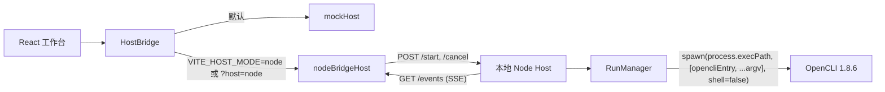

# P0-B：真实 Node Host 最小安全闭环

**状态：** 已确认
**首条真机命令：** `opencli 36kr news -f json`
**基线：** P0-A `main@b3061ac`，catalog 快照来自 OpenCLI `1.8.6`

## 1. 目标

让现有工作台在不改 UI 业务组件的前提下，从 `mockHost` 切换到真实
`nodeBridgeHost`，完成：

> 选中 `36kr/news` → 前端生成唯一 argv → Node Host 直接启动 OpenCLI 的
> Node 入口 → SSE 流式输出 → `done` 携带 JSON 表格结果。

本轮只交付 **PUBLIC + READ + browser=false** 的真实执行闭环。BrowserBridge、
COOKIE/INTERCEPT/UI、写命令和 Tauri Host 后置。

## 2. 架构决策



### 2.1 唯一执行事实源

- 前端 `buildTokens/buildArgv` 是 argv 的唯一构建者。
- 执行与预览都显式包含 `-f json`。
- Node Host 只校验，不补参数、不重排、不拼 shell 字符串。
- `process.execPath` 代替 PATH 中的 `node`，仍然是“直接启动 Node 入口”，同时
  避免 PATH 劫持。
- OpenCLI 入口通过项目依赖 `@jackwener/opencli@1.8.6` 解析为
  `dist/src/main.js`，不调用 `.cmd/.ps1` shim。

### 2.2 Host 选择

- 默认：`mockHost`，既有开发/测试行为保持不变。
- `VITE_HOST_MODE=node`：使用真实 Host。
- URL `?host=node`：仅覆盖 Host 类型，便于验收。
- `VITE_NODE_HOST_URL`：Node Host 基址，默认
  `http://127.0.0.1:43117`。

## 3. HTTP/SSE 契约

### `GET /health`

返回 Host 状态、版本和允许的执行策略，不启动命令。

### `GET /events`

长连接 SSE。事件类型：

```ts
type OutputEvent = {
  runId: string
  seq: number
  at: number
  stream: 'stdout' | 'stderr'
  text: string
}

type DoneEvent = {
  runId: string
  at: number
  outcome: 'success' | 'error' | 'cancelled'
  exitCode?: number
  result?: Record<string, unknown>[]
  error?: { summary: string; detail?: string }
}
```

```ts
// 第三种事件（P0-C 块 C 清理时新增，加法式扩展，旧客户端忽略未知类型即向后兼容）
type GapEvent = {
  reason: 'evicted' | 'restart'   // 缓冲驱逐 / 服务端重启(客户端游标超前，丢失区间未知)
  from: number
  to: number | null               // restart 时为 null
}
```

- 每个 run 的 `seq` 从 0 开始严格递增，stdout/stderr 共用序列。
- 每个 run 恰好一个 `done`。
- SSE 带全局 event id，并保留有限内存重放缓冲（默认 2048）；EventSource 重连时按
  `Last-Event-ID` 补发，前端按 `runId + seq` 去重。
- **补发缺口显式化**：若续传位置早于缓冲最老事件（驱逐）或客户端游标 ≥ `nextId`（重启），
  先发一条 `gap` 事件再补发残存事件。`gap` 帧**不带 `id:` 行**——按 HTML 规范，
  无 `id:` 的帧不重置 last event ID buffer，故不打乱客户端续传游标。
  **当前射程（诚实标注）**：服务端可观测（wire 有帧 + `console.warn`）；
  `nodeBridgeHost` 只监听 `output`/`done`，**gap 在客户端仍是死信** ——
  App 层「不再静默丢事件」尚未成立，客户端消费（如 RunPanel 显示「输出有缺口 N–M」）列为 P1。
- `nodeBridgeHost.startCommand` 在 SSE `open` 后才发送 `/start`，消除首包竞态。

### `POST /start`

请求：

```json
{
  "runId": "run-1",
  "commandKey": "36kr/news",
  "argv": ["36kr", "news", "-f", "json"]
}
```

成功返回 `202 {"runId":"run-1"}`。重复 `runId` 返回 `409`。

### `POST /cancel`

请求：`{"runId":"run-1"}`。取消幂等，成功返回 `204`。

## 4. 执行与生命周期

1. `spawn(process.execPath, [opencliEntry, ...argv], {shell:false})`。
2. stdout/stderr 分别按行切分；尾部无换行内容也必须发出。
3. stdout 同时聚合，用于成功退出后的 JSON 解析。
4. `exitCode === 0` 且 JSON 合法 → `success`；数组直接作为表格行，对象包装成
   单行。
5. 启动错误、非零退出、超时、JSON 解析失败 → `error`。
6. 用户取消先发 `SIGTERM`；2 秒后仍存活则发 `SIGKILL`。
7. 取消与自然结束竞态以 `close(exitCode, signal)` 为准：有终止 signal 才归为
   `cancelled`；已自然退出则保留 success/error。
8. 命令运行超时默认 90 秒，可通过环境变量调整；超时归为 `error`。

## 5. P0-B 安全边界

Node Host 是执行边界，浏览器请求一律视为不可信：

- 仅监听 `127.0.0.1`。
- 只接受配置白名单内的 `Origin`；JSON POST 必须是
  `application/json`，请求体上限 64 KiB。
- 从 `public/catalog.snapshot.json` 验证命令存在，且：
  `access=read`、`strategy=public`、`browser=false`。
- 校验 `commandKey === argv[0] + "/" + argv[1]`。
- 要求 argv 显式选择 JSON 格式。
- 默认仅允许一个并发 run；runId、argv 数量和单 token 长度均设上限。
- Host 不接受 shell 字符串，不执行 catalog 外的 OpenCLI 顶层/外部命令。

该策略不是永久产品权限模型；它是 P0-B 的主动限界。后续 BrowserBridge/write
必须单独设计能力授权与确认机制后再放开。

## 6. 开发运行

两个终端：

```powershell
npm run dev:server
npm run dev:node
```

- `dev:server`：启动本地 Host。
- `dev:node`：以 node 模式启动 Vite。
- `npm run dev`：仍为 mock 模式。

## 7. 验收

### 自动化

- buildTokens：bool 键缺失时省略；显式值与默认不同才发值式布尔。
- RunManager：seq 严格递增、done-once、启动失败、非零退出、成功 JSON、
  cancel SIGTERM→SIGKILL、超时。
- HTTP：Origin、body、catalog policy、commandKey/argv、重复 runId。
- nodeBridgeHost：SSE 分发、连接就绪后 start、HTTP 错误、cancel。
- host selector：默认 mock，env/query 可切 node。
- `npm test`、`npm run build` 全绿。

### 真机

1. `GET /health` 成功。
2. 工作台切到 node 模式，选择 `36kr/news`。
3. 点击运行，日志实时出现且 seq 连续。
4. 终态为成功，结果表显示 `rank/title/summary/date/url`。
5. 服务端记录的实际程序为 Node 入口，`shell=false`。
6. 至少一个慢 fixture 验证取消最终进入 `cancelled`。

## 8. 明确不在本轮

- BrowserBridge/COOKIE/INTERCEPT/UI 命令。
- write/login 命令。
- Tauri Host 与 exe 打包。
- 多任务队列、历史持久化、断电恢复。
- 远程 Host、多用户鉴权、TLS。
